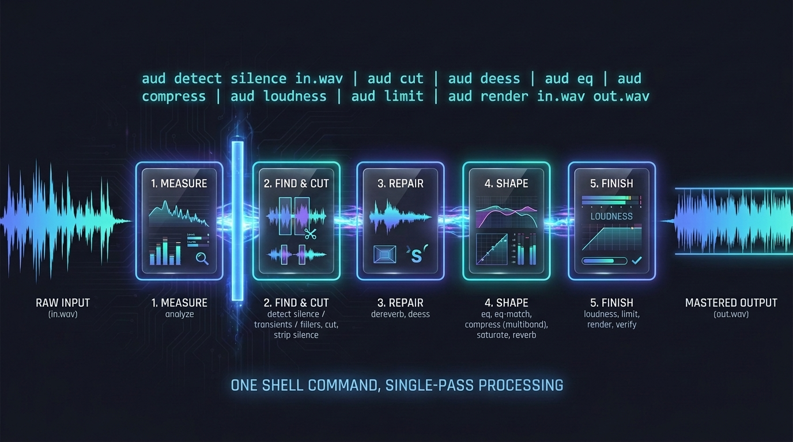

# aud

Master and clean up audio from the command line or from Python. `aud` measures a finished
programme — loudness, true peak, crest factor, spectral balance, sibilance, ambience — finds
what is in it — onsets, silences, filler words — then runs it through an editing and mastering
chain and reports what it did.

It is an [Amplifier Smart Tool](https://github.com/microsoft/amplifier-smart-tools): a library
with a manifest and a thin CLI over the top. Most of it is deterministic signal processing and
needs no AI provider at all; two verbs (`advise`, `master --auto`) call a model to choose a
chain, and they are the only two that do.

**This is mastering and cleanup, not mixing.** It works on a finished stereo or mono file. It
has no stems, no multitrack, no panning, no bus routing.


*One waveform through the whole chain: measured, cut, repaired, split into bands and compressed,
brought to −14 LUFS, then flattened against a −1.0 dBTP ceiling it never crosses.*



## Who it is for

- Someone with a finished file that is too quiet for a platform, too harsh, too boxy, or does
  not match the episode they released last week.
- An agent acting on that person's behalf, which needs measurements it can read and a plan it
  can inspect before anything is written.
- A product that needs all of the above under a permissive licence. `aud` is MIT, and stays MIT
  by writing its own DSP rather than depending on the mature GPL libraries in this space. See
  [docs/VISION.md](docs/VISION.md) for why that trade was made.

## Install

```bash
uv tool install git+https://github.com/colombod/amplifier-smart-tools-audio
```

With the optional time-stretch extra (Signalsmith Stretch, MIT):

```bash
uv tool install 'aud[stretch] @ git+https://github.com/colombod/amplifier-smart-tools-audio'
```

With the optional speech extra, needed only by `aud detect fillers` (faster-whisper, MIT — a
**local** model, no provider and no credential):

```bash
uv tool install 'aud[speech] @ git+https://github.com/colombod/amplifier-smart-tools-audio'
```

Then check what the host can actually do:

```bash
aud check
```

`check` reports whether `ffmpeg` is present (needed only for mp3/m4a/ogg — WAV, FLAC and AIFF
work without it) and whether any AI provider credential is configured (needed only for `advise`
and `master`).

## Measure before you touch anything

```bash
aud analyze in.wav
```

One JSON document on stdout: loudness in LUFS, true peak, crest factor, per-band energy, a
sibilance estimate and an ambience estimate. Nothing is modified.

## One command, not a conversation

Get the whole job done in a **single shell command**. Do not run a stage, read the result,
decide the next one, run that — every round trip back through the caller is latency, tokens and
another chance to lose the thread, and none of it buys anything, because the whole chain can be
written down before any of it runs. Three ways in, for three kinds of caller:

| You know | Use |
|---|---|
| what the chain should be | `aud plan \| aud eq ... \| aud render in.wav out.wav` |
| only what the result should be like | `aud master in.wav out.wav` — model-backed, decides for you |
| that a known-good chain exists | `aud preset show podcast \| aud render in.wav out.wav` |

## Build a chain by piping

Every stage verb reads a mastering plan on stdin, appends one stage, and writes the plan back
out. Nothing touches a sample until `render`:

```bash
aud plan \
  | aud deess --amount 6 \
  | aud eq --hpf 40 --peak 3200,-2.5,1.4 \
  | aud compress --bands 120,900,5500 --ratio 2.5 \
  | aud saturate --drive 1.5 --mix 0.25 \
  | aud loudness --target -14 \
  | aud limit --ceiling -1.0 \
  | aud render in.wav out.wav
```

That is one decode, one filter graph, one encode. Do not run each stage as its own render —
every extra render is another round of quantisation and another chance to clip.

`render` applies stages in canonical order regardless of the order you appended them:

```
editing (cut, strip-silence) -> repair (de-ess, de-verb) -> tone (EQ, EQ-match)
  -> dynamics (multiband compression) -> character (saturation, ambience)
  -> loudness -> limiting
```

## Find things, then cut them — still one command

`aud detect` finds things and prints a **regions document**
([contracts/regions.v1.md](contracts/regions.v1.md)) — where the silences are, where the onsets
are, where the "umm"s are. `aud cut` consumes one. So finding and removing is one invocation,
not three turns:

```bash
aud detect silence in.wav | aud cut | aud render in.wav out.wav
```

Or carry a rule instead of a list, which is reusable across every episode:

```bash
aud plan | aud strip-silence --min-len 400 --keep 150 | aud render in.wav out.wav
```

Three things worth knowing:

- **Editing renders first**, ahead of repair and tone. Cutting changes the timeline everything
  downstream measures — target −14 LUFS across material a cut later removes and the number you
  hit describes a file that no longer exists.
- **The silence threshold is relative to the file's measured noise floor**, not a fixed dBFS
  value. A fixed number is right for exactly one recording: a treated room may floor at
  −70 dBFS and a phone in a kitchen at −38 dBFS, and one number finds nothing in the first file
  and eats words in the second. The measured floor is written into the regions document, so the
  judgement can be checked.
- **A detector's boundary is not where the blade falls.** The position is *nominal*; the edit
  point is resolved from it — padded, then snapped inside a bounded window to a zero crossing, a
  quiet spot, or just before an onset — because a cut through the attack of a word truncates it
  and a cut at a non-zero sample clicks. A snap that finds nothing acceptable keeps the original
  position and says so in the report rather than failing quietly:

  ```bash
  # trim the pauses without chopping the start of a word
  aud detect silence in.wav \
    | aud cut --pad-in 80 --pad-out 80 --snap transient --snap-window 60 \
    | aud render in.wav out.wav
  ```

`detect fillers` needs the optional `speech` extra. Without it, that one verb refuses and names
the extra; it never falls back to an energy-only guess, because those regions would look like
words and `cut` would remove them.

> **Status:** `detect`, `cut` and `strip-silence` are specified and registered but **not
> implemented** in 0.3.0 — they parse their full documented argument surface, including every
> edit-point flag above, and return `{"error": {"code": "not_implemented", ...}}`. No padding,
> snap, fade or crossfade code exists. The two contract documents are written so callers can be
> built against them.

### Keep the chain, re-use it

A plan is a JSON document ([contracts/plan.v1.md](contracts/plan.v1.md)), so it can be saved,
read, diffed and re-run:

```bash
aud plan | aud loudness --target -14 | aud limit --ceiling -1.0 > podcast.plan.json

aud render ep-01.wav ep-01-master.wav < podcast.plan.json
aud render ep-02.wav ep-02-master.wav < podcast.plan.json
```

### Check the result against what you asked for

```bash
aud verify out.wav
```

Loudness normalisation is a gain change and does not guarantee a ceiling — that is the
limiter's job. `verify` measures the finished file so the claim is checked rather than assumed.

## Verbs

| Verb | | What it does |
|---|---|---|
| `analyze` | deterministic | What is actually in the file: LUFS, true peak, crest, bands, sibilance, ambience |
| `detect transients` `detect silence` | deterministic | Where things are: onsets, quiet spans. Emits a regions document, not a plan |
| `detect fillers` | deterministic, needs `aud[speech]` | "umm", "uh", "ehm" and long hesitations, with word-level timings |
| `plan` | deterministic | Start an empty chain, or load one from a file |
| `cut` | deterministic | Editing stage: remove a listed set of regions, crossfaded at every join |
| `strip-silence` | deterministic | Editing stage: remove or shorten the silences, by a rule rather than a list |
| `deess` `dereverb` | deterministic | Repair stage |
| `eq` `eq-match` `curve` | deterministic | Tone stage, including extracting a curve from one file and applying it to another |
| `compress` | deterministic | Multiband compression and dynamic range control |
| `saturate` `reverb` | deterministic | Character stage |
| `stretch` `pitch` | deterministic | Retime or re-pitch |
| `loudness` `limit` | deterministic | Loudness target and true-peak brickwall ceiling |
| `render` | deterministic | Apply the whole chain in one pass |
| `verify` | deterministic | Measure a render against the targets it was asked for |
| `preset` | deterministic | Named chains for common destinations |
| `check` `config` `manifest` | deterministic | What this host has, effective settings, the manifest |
| `advise` | **model-backed** | Read the measurements and say what the chain should be, and why |
| `master` | **model-backed** | Choose the chain, apply it, and verify the result |

## Deterministic paths need no credentials

Everything marked deterministic above runs with no AI provider configured and no credential
present. It spends nothing and is safe to call freely, including from an agent in a loop. That
includes `detect fillers`: the `speech` extra is a **local** model, not a provider — it needs
an install, never a credential.

Only `advise` and `master --auto` need a provider. Without one they refuse and say so, naming
the remedy, rather than guessing a chain. Any one of `ANTHROPIC_API_KEY`, `OPENAI_API_KEY`,
`GOOGLE_API_KEY`, `GEMINI_API_KEY` or `AZURE_OPENAI_API_KEY` satisfies the requirement —
see [docs/CONFIGURATION.md](docs/CONFIGURATION.md). `aud` reads credentials; it never writes
or stores them.

Even when a model chooses the chain, it never touches samples. It reads measurements and emits
a plan; the same deterministic engine renders that plan as it would one you typed by hand.

## Output contract

One JSON document on stdout. Success is `{"result": ...}`; failure is
`{"error": {"code", "message", "remedy"}}` with a non-zero exit. Progress and diagnostics go to
stderr, never stdout. A plan on stdout is the plan document itself, so verbs pipe into each
other without unwrapping — and so is a regions document, which is why `detect` pipes straight
into `cut`.

## From Python

The library is the tool. `aud.lib` holds every capability and the CLI is a thin wrapper over
it — anything available in the shell is available in Python, with the same arguments and the
same results.

## Documentation

| Document | What is in it |
|---|---|
| [src/aud/SMART_TOOL.md](src/aud/SMART_TOOL.md) | The manifest — what the tool is and what it needs |
| [docs/VISION.md](docs/VISION.md) | Why this exists, what it will not do |
| [docs/ARCHITECTURE.md](docs/ARCHITECTURE.md) | How it is built: plan document, chain topology, module layout |
| [docs/CONFIGURATION.md](docs/CONFIGURATION.md) | Settings, credentials, precedence |
| [contracts/plan.v1.md](contracts/plan.v1.md) | The plan document another program may parse |
| [contracts/regions.v1.md](contracts/regions.v1.md) | The regions document `detect` emits and `cut` consumes |
| [CONTRIBUTING.md](CONTRIBUTING.md) | Setup, lint, test, conformance |

## Licence

MIT. See [LICENSE](LICENSE).
