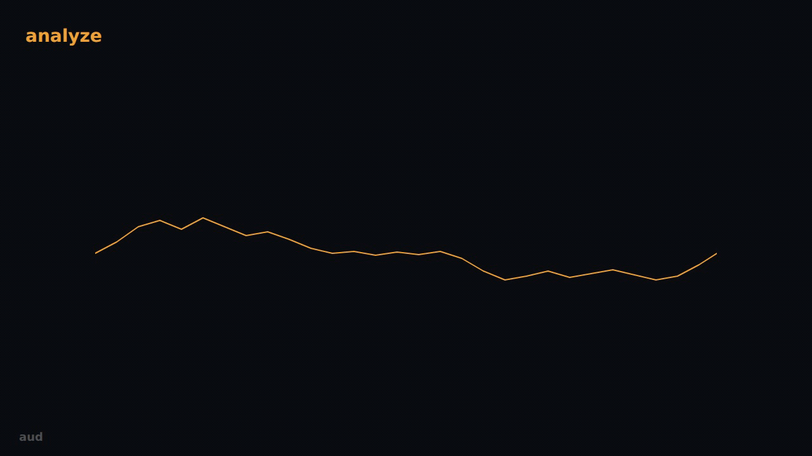
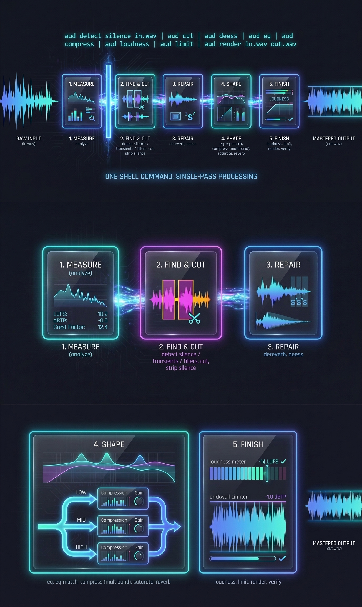

# Architecture

The mechanics. Why this tool exists and what it refuses to do is [VISION.md](VISION.md).

## 0. Install it, then follow the signal

```bash
uv tool install git+https://github.com/colombod/amplifier-smart-tools-audio
aud check          # what this host has, and what each gap costs you
```

Then the whole job, as one shell command:

```bash
aud detect silence in.wav \
  | aud cut \
  | aud deess \
  | aud eq --hpf 60 \
  | aud compress --bands 150,1200,6000 \
  | aud loudness --target -14 \
  | aud limit --ceiling -1.0 \
  | aud render in.wav out.wav
```



*One waveform, one frame, mutating in place: measured, cut shorter, repaired, split into four
bands each compressed by a different amount, recombined, brought to −14 LUFS, then flattened
against a −1.0 dBTP ceiling it never crosses. Rendered with
[unfold](https://github.com/robotdad/amplifier-smart-tool-unfold);
[how it was made and how to regenerate it](images/RECORDING.md).*

The same chain as a still, for reading rather than watching:



Five phases, left to right. **Measure** reports what is actually there and changes nothing.
**Find and cut** locates pauses, onsets and filler words, then removes them with the blade
placed deliberately rather than wherever the detector's boundary fell. **Repair** reduces a
room and tames sibilance. **Shape** is tone and dynamics — including multiband compression,
where the signal is split at Linkwitz-Riley crossovers, each band is treated on its own, and
the bands are recombined. **Finish** hits a loudness target and holds a true-peak ceiling.

Every verb but `render` only appends to a plan. Nothing touches a sample until `render`,
which applies the entire chain in a single pass. The rest of this document is how that works.

## 1. The plan document is the central contract

Nothing in `aud` is a hidden session state. A chain is a JSON document:

```json
{
  "plan_format": 1,
  "created_with": "aud 0.1.0",
  "stages": [
    {"stage": "deess", "params": {"amount_db": 6.0}},
    {"stage": "loudness", "params": {"target_lufs": -14.0}},
    {"stage": "limit", "params": {"ceiling_dbtp": -1.0}}
  ]
}
```

Every stage verb reads a plan on stdin, appends exactly one stage, and writes the plan back to
stdout. `render` is the only verb that opens an audio file for processing. The full schema —
what is promised, what is not, and how it versions — is [contracts/plan.v1.md](../contracts/plan.v1.md).

Three things follow from this, and they are the reason for the design:

- **A chain is reviewable before it runs.** Particularly important when a model proposed it.
- **A chain is reusable.** The same document renders episode 1 and episode 40, byte-identically
  in its parameters.
- **A chain is diffable.** "What changed between these two masters" is a text diff, not an
  archaeology exercise.

## 1b. The regions document is the second contract

The plan says *what to do*. A **regions document** says *where things are*:

```json
{
  "regions_format": 1,
  "created_with": "aud/0.3.0",
  "source": "in.wav",
  "sample_rate": 44100,
  "kind": "silence",
  "detection": {"threshold_above_floor_db": 6.0, "min_len_ms": 400.0, "noise_floor_dbfs": -58.3},
  "regions": [{"start_s": 12.48, "end_s": 13.94, "peak_dbfs": -54.1, "rms_dbfs": -57.8}]
}
```

Every `aud detect` verb emits one; `aud cut` consumes one. Full schema:
[contracts/regions.v1.md](../contracts/regions.v1.md). It versions independently of the plan —
`regions_format` and `plan_format` are separate integers, because a change to what a detector
reports is not a change to what a chain does.

**Why a second document rather than a field on the plan.** Detection is read-only and the plan
is a work order; folding one into the other would mean `aud detect` had to produce a plan in
order to say what it found, and a caller that only wanted to *look* would get a work order back.
Keeping them separate is also what makes the pipe work in both directions of use: `detect` alone
answers "where are the pauses", and `detect | cut` answers "remove them", with the same command
and no extra machinery.

**The split inside editing follows from the same distinction.** `cut` carries *positions*, which
only mean something on the file they were measured from. `strip_silence` carries a *policy* —
threshold, minimum length, padding — which means the same thing on any file. That is why a
`strip_silence` plan is reusable across a season of episodes and a `cut` plan is not, and why
they are two stages rather than one with a mode flag.

## 2. Canonical stage ordering

Mastering is an ordered chain. The order stages were *appended* is a property of how someone
typed a pipeline; the order they are *applied* is a property of what the signal needs. `render`
sorts stages into canonical order and states in its report that it did so:

```
["cut", "strip_silence",
 "stretch", "pitch", "dereverb", "deess", "eq", "eq_match",
 "compress", "saturate", "reverb", "loudness", "limit"]
```

Grouped, that is: **editing → repair → tone → dynamics → character → loudness → limiting.**

The ordering is not arbitrary. Repair before tone, because de-essing a resonance you are about
to cut wastes gain reduction. Tone before dynamics, because a compressor's detector hears the
EQ. Loudness before limiting, because loudness is a gain change and the limiter must be the last
thing that sees the signal. Anything appended after `limit` in a pipeline still renders before
it — there is nothing downstream of the ceiling.

### Editing goes at the front, and it has to

`cut` and `strip_silence` remove material, and that puts them ahead of everything — ahead of
repair, ahead of tone, ahead even of `stretch`. Two independent reasons, either of which alone
would settle it:

**Every measurement downstream is a measurement of a timeline.** Integrated loudness is an
average over duration. If `loudness` normalises to −14 LUFS across a programme and `cut` then
removes forty seconds of it, the measurement described a file that no longer exists — and the
one that ships misses the target it was given. The limiter has the same problem in a sharper
form: it enforces a ceiling against the peaks it saw, and the peaks it saw may not be the peaks
that survive. `verify` would then correctly report a failure on a plan that looks like it should
have passed, and the plan would be blamed for the ordering's mistake.

**Region positions are offsets into the source timeline.** A `cut` region came from a detector
that measured the original file. Anything that re-times the programme invalidates those offsets,
which is exactly what `stretch` does — so `stretch` sits immediately after the two editing
stages rather than first, where it used to sit. This is the one place where adding editing moved
an existing stage's *neighbour*, and it moved for a reason that can be stated in one line:
you cannot cut at 12.48 s on a timeline that has been stretched to 0.98×.

Between the two editing stages, `cut` runs first: it needs the untouched source timeline, while
`strip_silence` detects at render time and is content with whatever is left.

This insertion stayed inside `plan_format: 1`. The argument — no pre-0.2.0 plan can contain
these names, so no stored plan renders differently — is recorded in
[plan.v1.md](../contracts/plan.v1.md#on-the-record-why-cut-and-strip_silence-did-not-move-the-integer),
not left to be reconstructed later.

## 2b. One command, not a conversation

The tool is shaped so that **a caller gets the whole job done in one shell command.**

The alternative — run a stage, read the JSON, decide the next stage, run that — is what a tool
without a document contract forces on you. It costs a round trip per stage, and for an agent
caller each round trip is latency, tokens, and one more opportunity to lose the thread of what
it was doing. None of that cost buys anything, because the entire chain can be written down
before any of it runs. So it is written down, and `render` executes it.

Three mechanisms serve that one goal, and they are a deliberate set rather than three unrelated
features — they cover three kinds of caller:

| The caller knows | Mechanism |
|---|---|
| exactly what the chain should be | the pipe chain: `aud plan \| aud eq ... \| aud compress ... \| aud render in.wav out.wav` |
| only what the result should be like | `aud master in.wav out.wav` — the model reads the measurements and decides |
| that a known-good chain exists for this destination | `aud preset show podcast \| aud render in.wav out.wav` |

Detection joins the same set rather than sitting outside it. Because `detect` emits a document
and `cut` consumes one, finding and removing is one command:

```bash
aud detect silence in.wav | aud cut | aud render in.wav out.wav
```

Three agent turns collapse into one. That is the whole argument for the regions document being a
document.

The pattern generalises beyond audio — it was proven first in the sibling video tool, `vid`, and
the property that makes it work is not domain-specific: **every verb's output is a document the
next verb accepts, and nothing needs a decision made between them.** A tool that returns prose,
or that requires a caller to pick the next step from a result, cannot be chained this way no
matter how good its individual verbs are.

## 2c. Edit points are resolved, not taken literally

A detector says a silence runs from 12.480 s to 13.940 s. It does not follow that 13.940 is
where the blade should fall, and treating it as though it does is the single most audible
mistake an editing tool can make.

Two distinct failures, with different causes:

- **Truncation.** The blade lands after a sound has begun. The attack is kept, the rest is gone,
  and what is left reads as a glitch rather than as a word. This happens because a detector's
  boundary is a *threshold crossing*, and a threshold crossing is systematically inside the
  speech — the tail of a word drops below the threshold while the word is still going, and the
  next word's attack rises above it a few milliseconds after it has started.
- **The click.** The blade lands at a non-zero sample value, so the splice is a step
  discontinuity in the waveform. A step is broadband energy at the moment of the join. No amount
  of correct *placement* fixes this; it is an alignment problem, not a placement one.

So `aud` names a layer between detection and cutting: **edit-point resolution**. A region
carries a **nominal** position; resolution moves it, within a bounded window, to somewhere it is
safe to cut. It is a named concept rather than a scattering of flags because the alternative —
`--pad`, `--snap-to-zero`, `--avoid-transients` accumulating one at a time — is how a coherent
decision becomes six interacting ones that nobody can reason about together.

The parameters are specified in
[plan.v1.md](../contracts/plan.v1.md#edit-point-resolution-shared-by-cut-and-strip_silence).
What follows is why they are shaped that way.

### The three snap rules, and what each one protects

| Rule | Moves the point to | Prevents |
|---|---|---|
| `zero_crossing` | the nearest zero crossing | the click. Sub-millisecond, costs nothing, always available in programme material. This is the **default and the floor**. |
| `silence` | the local minimum of the short-time energy envelope inside the window | cutting through something loud. The blade lands where there is least to damage. |
| `transient` | just **before** the nearest onset in the window | truncation. A sound that has begun and is then cut off is a glitch; removing it whole is not. |

`zero_crossing` sits **under** the other two rather than beside them. `silence` and `transient`
answer *where does this edit belong*, at the scale of tens of milliseconds; zero crossing
answers *how is it finally aligned*, at the scale of one sample. Those are different questions,
so `silence` and `transient` each end with a zero-crossing alignment. Only `none` turns the
alignment off, because `none` is the only value that asserts the caller already chose the exact
sample.

`transient` always moves a point **earlier**. Both boundaries of a removal have the same failure
mode — a sound that has started being cut mid-way — and the fix for it is always to place the
blade before the sound began. At the closing boundary that shortens the removal; at the opening
boundary it lengthens it, trading a truncated fragment for a clean absence.

**This is why transient detection earns its place beside silence detection.** Not as a second
way to find things to remove, but because without knowing where the attacks are, there is no way
to avoid landing on one. `detect transients` is the read-only face of the same capability.

### The bounded-window invariant

Every move is bounded, and the bound is an intersection of four constraints:

1. within `snap_window_ms` of the padded position,
2. never past the region's **other** boundary,
3. never into a **neighbouring** region,
4. never outside the file.

**If nothing acceptable exists inside that window, the resolver keeps the position it had and
says so** — `"snap_failed": true` on that edit point in the render report, with a reason. It
does not widen the window. It does not silently pick a different rule.

That refusal is the design decision, not an implementation detail. A snap that quietly fails
still produces a file, and the caller believes the edit was placed well; they find out on
playback, after delivery. A snap that refuses produces the same file *and a record of which
edits it could not place well*, which is something a caller can act on — by widening the window,
changing the rule, or reviewing those joins by ear.

### Why fades and crossfades exist, and why equal power is the default

They solve the two halves of a seam.

A **crossfade** joins two kept slices: the outgoing one fades down while the incoming one fades
up. `fade_out_ms` / `fade_in_ms` handle the case with no partner to cross into — the head of the
programme, its tail, or a join where the crossfade length is zero.

The default shape is **equal power** because **two uncorrelated signals sum in power, not in
amplitude.** Under a linear crossfade both sides sit at gain 0.5 in the middle, so the summed
power is half of either side's: an audible dip of roughly 3 dB, right through the join, on every
join. Equal power holds the sum of the *squared* gains constant instead, and perceived loudness
stays flat.

`linear` exists because the argument inverts for **correlated** material — a join across a
sustained tone, or across the same signal offset by a few samples. Correlated signals sum in
amplitude, so there equal power *bumps* by about 3 dB where linear is flat. Two physical cases,
two shapes; the default is the one that matches what a splice in a programme usually joins.

A crossfade also **consumes material on both sides of the join**: the two kept slices must
overlap by the crossfade length on the source timeline, and that overlap can only come out of
what is being removed. So a crossfade longer than the gap it spans would eat audio nobody asked
to touch. That is an **error** (`crossfade_exceeds_gap`), not something to clamp — a clamp
changes the sound at one join out of many with nothing in the output naming which one.

### How the two detectors compose

`detect silence` and `detect transients` measure different things and are separately useful, but
silence detection is **better when onset information is available**, and the reason is the same
truncation failure above: a silence boundary that sits immediately next to an onset must not be
trimmed into the onset.

The composition is one-directional and deliberately loose: onsets are an **advisory constraint
on where a silence boundary may be reported**, never a source of silence regions. The silence
detector still decides what is a silence; knowing where the attacks are only stops it from
claiming a boundary that lies inside one.

No algorithm is specified here, and that is on purpose — the detection functions are explicitly
[not promised](../contracts/regions.v1.md#not-promised) and will change. What is fixed is the
composition: two independent detectors, one of them constraining the other's boundaries, neither
one feeding the other regions.

### One position, all channels

Edit points are positions in the **file**, not per channel. A zero crossing in a stereo
programme is not at the same sample in both channels, so a per-channel search would produce two
different cut points and change the channel alignment across the seam — which is a worse defect
than the click it set out to fix. The search therefore runs on a mono sum, and the single
position it returns is applied to every channel.

## 3. The library is the tool

`aud.lib` holds every capability. The CLI parses arguments, calls the library, and serialises
the result to JSON. That is all it does.

**A capability that exists only in the CLI wrapper is a defect**, not a shortcut. If parameter
validation, default resolution, stage ordering or report formatting lives in `cli.py`, then the
Python caller gets a different tool from the shell caller, and the MCP or SDK adapter someone
writes later gets a third. One implementation, several thin surfaces over it.

The test for whether the boundary has been respected: could you delete `cli.py` and lose nothing
but argument parsing?

## 4. The single-render rule

The whole chain is applied in **one pass**: one decode, one filter graph, one encode.

Running each stage as its own render would be simpler to implement and is wrong. Each render is
another quantisation to the output subtype, another round of dither or truncation noise, and
another opportunity for an intermediate stage to exceed full scale and clip on write — with the
clipping baked in before the limiter ever sees it. Stage-by-stage rendering also destroys the
guarantee the limiter exists to provide: a ceiling enforced on an intermediate file says nothing
about the ceiling of the final one.

Internally, samples are carried as float64 from decode to encode and quantised exactly once, at
write.

## 5. Chain topology

```
  in.wav
    |
  [decode]  io: libsndfile, or ffmpeg for compressed formats
    |
    |  float64, channels preserved
    v
  EDITING .....  cut (listed regions) -> strip_silence (detected at render)
    |            nominal positions -> [RESOLVE: pad, snap, invariant] -> blades
    |            every join crossfaded (equal power by default); the timeline
    |            changes HERE and nowhere later, so every measurement below is
    |            of the material that will actually ship
    v
  REPAIR ......  dereverb -> deess
    |
  TONE ........  eq (biquad cascade) -> eq_match (measured curve -> filter bank)
    |
  DYNAMICS ....  multiband compression
    |            +-----------------------------------------------+
    |            |  Linkwitz-Riley 4th-order crossovers           |
    |            |  (two cascaded 2nd-order Butterworths/branch)  |
    |            |                                               |
    |            |        +--> band 0 --> gain computer 0 --+    |
    |            |        +--> band 1 --> gain computer 1 --+    |
    |   ---------+--------+--> band 2 --> gain computer 2 --+--(sum)--+
    |            |        +--> band N --> gain computer N --+    |    |
    |            +-----------------------------------------------+    |
    |                                                                 |
    v  <--------------------------------------------------------------+
  CHARACTER ...  saturate -> reverb
    |
  LOUDNESS ....  measure (ITU-R BS.1770 / pyloudnorm), apply ONE gain
    |
  LIMIT .......  single full-band, oversampled, lookahead true-peak brickwall
    |
  [encode]  quantise once, to the configured output subtype
    |
  out.wav  +  a report of what was measured and what was applied
```

### Why multiband, and why Linkwitz-Riley

Multiband is the default for dynamics, not an option bolted on. One full-band gain computer
means a kick drum ducks the vocal and a loud S ducks the bass. Splitting the signal lets each
region be controlled by its own energy. A single-band squeeze is what you get by asking for one
band, deliberately.

The crossover is Linkwitz-Riley 4th-order — two cascaded 2nd-order Butterworth sections per
branch. That is the standard choice because the summed low and high branches recombine with flat
magnitude, so a band with no gain reduction applied returns the original signal rather than a
peak or a notch at the crossover frequency. Bands are recombined by summation.

### Why exactly one limiter, on the sum

Compression is multiband; **limiting is not.** The brickwall runs once, full-band, after
recombination.

The reason is arithmetic: per-band brickwall limiting does not guarantee the final ceiling,
because independently limited bands can sum above it. Three bands each held at −1 dBTP can sum
to well above −1 dBTP. The only place a ceiling can be enforced is the last point where the
signal exists as one stream.

This is the same split the established tools make: FabFilter separates Pro-MB (multiband
dynamics) from Pro-L2 (the final limiter); iZotope Ozone separates the Dynamics module from the
Maximizer. It is not a simplification we made — it is the correct topology.

### True peak is not sample peak

A sample peak is the largest value in the array. A **true peak** is the largest value the
reconstructed analogue waveform reaches between samples, and it can exceed the sample peak. You
cannot see it without oversampling: upsample (4× by default), measure there, and control there.
It matters because downstream lossy encoders reconstruct that inter-sample peak, and a file that
measures 0.0 dBFS at sample rate can clip a consumer's decoder.

The limiter therefore works oversampled and with lookahead, so gain reduction is applied
*before* the peak arrives rather than after it. EBU R128 recommends a maximum true peak of
−1 dBTP, which is the default ceiling here.

### Loudness normalisation is gain, and gain only

The `loudness` stage measures integrated loudness and applies a single gain to reach the target.
It does not and cannot guarantee a ceiling — raising a programme by 6 dB raises its peaks by
6 dB. Enforcing the ceiling is the limiter's job, which is why `limit` is downstream of
`loudness` in canonical order and why `verify` measures the finished file rather than trusting
the arithmetic.

## 6. Module layout

Two packages under `src/aud/`. The rule that separates them: **`dsp/` takes arrays and
parameters and returns arrays.** It never reads configuration, never touches the filesystem,
never raises a user-facing error, and does not know that plans exist.

| Module | Responsibility |
|---|---|
| `core/io` | Decode and encode. libsndfile via `soundfile`; ffmpeg for compressed formats. Float64 in memory, quantise on write. |
| `dsp/filters` | Biquad primitives: peaking, shelf, high-pass, low-pass. The building block everything tonal is made of. |
| `dsp/crossover` | Linkwitz-Riley 4th-order band splitting and flat recombination. |
| `dsp/dynamics` | Envelope detection and gain computers: threshold, ratio, knee, attack, release. Per band. |
| `dsp/limiter` | Oversampled, lookahead true-peak brickwall. One instance, full-band, last. |
| `dsp/saturation` | Waveshaping with drive and dry/wet mix. |
| `dsp/loudness` | ITU-R BS.1770 measurement (`pyloudnorm`) and the gain that reaches a target. |
| `dsp/edit` | Region removal, fades at an unpartnered boundary, and equal-power or linear crossfade at a join. Arrays and **resolved** edit points in, arrays out. It does no placement of its own. |
| `dsp/resolve` | Edit-point resolution (§2c): nominal positions plus params in, resolved positions plus the rule that placed each one out. Zero-crossing search, energy-minimum search, onset avoidance, and the bounded-window invariant live here. |
| `dsp/detect` | Onset detection (spectral flux / high-frequency content) and noise-floor-relative silence detection. Returns positions; knows nothing about documents. |
| `core/analysis` | The measurement report: loudness, true peak, crest factor, band energies, sibilance, ambience. What `analyze` returns and what the model reads. |
| `core/regions` | The regions document: build it, validate it, serialise it. The counterpart of `core/plan`. |
| `core/speech` | The `speech`-extra boundary. Imports `faster-whisper` **lazily, inside the call**, and raises `speech_extra_missing` when it is absent. |
| `core/engine` | Validate the plan, sort into canonical order, build the graph, run it once, emit the report. |

`core/plan`, `core/config` and `core/errors` carry the plan document, settings resolution
(see [CONFIGURATION.md](CONFIGURATION.md)) and the `{code, message, remedy}` error shape.

The `dsp/` boundary holds for the new modules too: `dsp/detect` returns sample positions, and
turning those into a regions document — with `source`, `sample_rate` and the measured noise floor
— is `core/regions`' job. A detector that emitted a JSON document would have crossed the line
this layout exists to draw.

`core/speech` follows the same lazy-import rule as the model backends, for the same reason
stated in §7: a top-level `import faster_whisper` would make every deterministic path in the
tool depend on an *optional* extra being installed, which is precisely the property the tool
claims not to have.

> **Status.** The two document contracts, the canonical order, the verb surface and the
> edit-point resolution design (§2c) are in place as of 0.3.0. The modules in this table marked
> as detection, resolution and editing — `dsp/detect`, `dsp/resolve`, `dsp/edit`,
> `core/regions`, `core/speech` — are **specified, not written**. `aud detect`, `aud cut` and
> `aud strip-silence` parse their full documented argument surface and return
> `not_implemented`. No padding, snap, fade or crossfade code exists.

## 7. Where intelligence attaches

```
   analyze  ------>  measurements (JSON)
                          |
                          v
                     advise / master --auto     <-- the only model call
                          |
                          v
                     a plan document
                          |
                          v
                     render (deterministic)  ------>  audio
```

`advise` and `master --auto` read the measurement report and choose stages and parameters, with
a stated reason. **They never touch samples.** Their entire output is a plan document, which
then goes through the same engine as a plan typed by hand.

That boundary is deliberate and load-bearing:

- A model failure produces a bad *plan*, visible before rendering, rather than corrupted audio.
- The expensive path is bounded — one call on a few kilobytes of measurements, not on audio.
- Everything else in the tool keeps working with no provider configured, because nothing else
  in the tool has a model in its call path.
- The model is chosen by configuration, never hardcoded, so the same tool runs against whichever
  provider the host already has.

Model backends are imported lazily, inside the two verbs that need them. Importing a provider
at module load would make the deterministic verbs depend on a provider being installed, which
is precisely the property this tool claims not to have.
